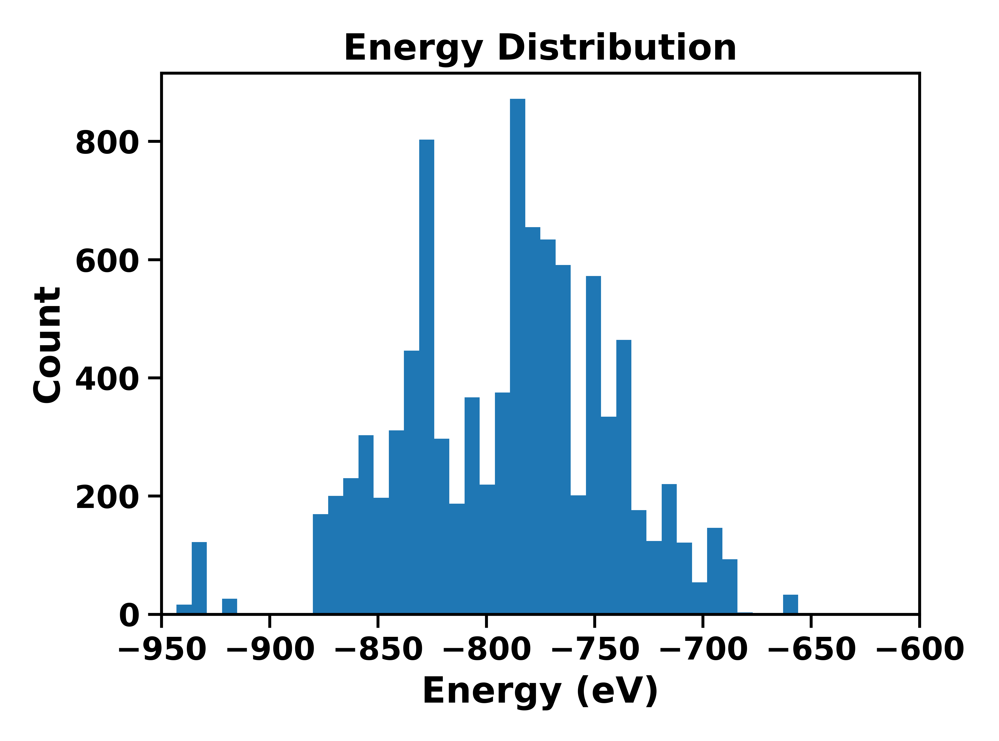
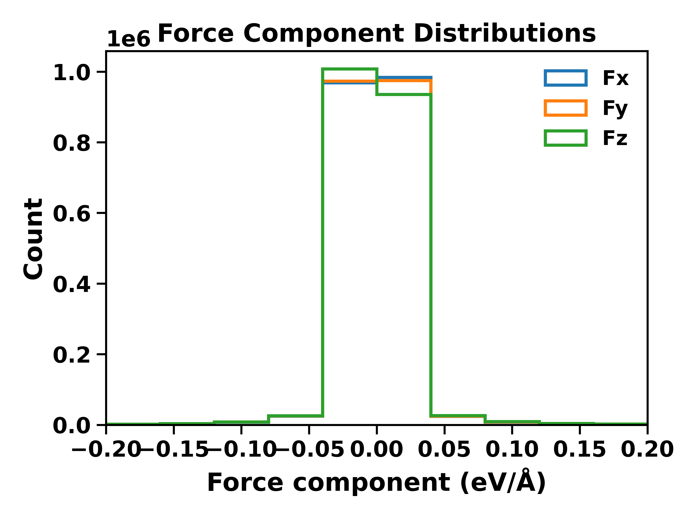

<h1 align="left"><b>Sequential Pipeline for Preparing the DFT Geo-Optimization Dataset</b></h1>

Follow these steps in order.

<h2><b>1) Extract all intermediate steps to JSON</b></h2>

<strong>Script:</strong> \[`extract\_all\_intermediate\_info.py`](./extract\_all\_intermediate\_info.py)   

Use this to extract all intermediate steps during DFT optimization for different structures into JSON files.   

Example: If you have a geo-opt record for <code>structure\_1</code> with intermediate steps in folders like <code>geo\_opt</code>, <code>geo\_opt\_2</code>, <code>geo\_opt\_3</code>, and so on, then all coordinates, energy, force, stress, lattice parameters, and volume from those steps will be saved into <code>structure\_1.json</code>.   

The same applies to other structures (e.g., <code>structure\_2.json</code>).   

All JSON files will be saved in a single directory.

<h2><b>2) Inspect energy/force ranges before filtering</b></h2>

<strong>Script:</strong> \[`energy\_force\_component\_distribution\_before\_filter.py`](./energy\_force\_component\_distribution\_before\_filter.py)   

Use this to check the ranges of energy and force values for filtering.   

In early geo-opt steps, energies can be very high (out of range) and not useful for the dataset; the same can happen for forces.

<h2><b>3) Take every 10th step and combine to a CSV</b></h2>

<strong>Script:</strong> \[`combine\_to\_csv\_at\_each\_10th\_step.py`](./combine\_to\_csv\_at\_each\_10th\_step.py)   

To avoid very similar consecutive structures, take every 10th step for each structure individually from the folder created in Step 1.   

This script then combines all individual JSON files into a single CSV file.

<h2><b>4) Filter outliers by energy and forces</b></h2>

<strong>Script:</strong> \[`filter\_en\_force.py`](./filter\_en\_force.py)   

After you understand the distributions from Step 2, use this to filter out outliers in energy and force values from the CSV produced in Step 3.

<h2><b>5) Visualize the filtered distributions</b></h2>

<strong>Script:</strong> \[`plot\_energy\_force\_hist.py`](./plot\_energy\_force\_hist.py) 

Visualize the distributions of the filtered CSV dataset file (energy and force components) to confirm the filtering looks sensible.

&nbsp;  

&nbsp; 

<h2><b>6) Deduplicate similar structures with StructureMatcher (pymatgen)</b></h2>

<strong>Tool script:</strong> \[`structure\_matcher.py`](./structure\_matcher.py) (uses <i>pymatgen</i>’s <code>StructureMatcher</code> and the <code>stol</code> parameter)   

Further filter the dataset after Step 4 by removing structurally similar entries using pymatgen’s StructureMatcher.   

Tune the <code>stol</code> parameter to control how strictly similar structures are considered duplicates.

